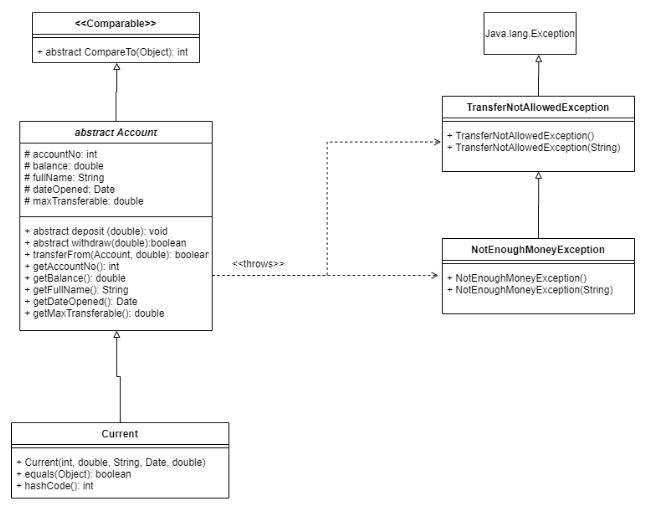

# java-banking-account-management

Banking System Logic (Java)

A Java-based implementation of a banking account management system. This project focuses on Object-Oriented Programming (OOP) principles, specifically inheritance hierarchies and custom exception handling, developed from a formal UML Class Diagram.

🛠 Features

    Abstract Foundation: Uses an abstract Account class to enforce a contract for all account types (Current, Savings, etc.).

    Transaction Logic: Implements deposit, withdraw, and transferFrom methods with strict validation.

    Custom Exception Hierarchy: Includes a multi-level exception structure to handle business logic failures (e.g., exceeding transfer limits vs. insufficient funds).

    Object Comparison: Implements the Comparable interface to allow accounts to be sorted by balance or ID.

📐 UML Specifications

The project was built to strictly adhere to a provided UML blueprint. Key architectural decisions include:

    Inheritance: CurrentAccount extends Account.

    Exception Subtyping: NotEnoughMoneyException inherits from TransferNotAllowedException, demonstrating an understanding of specific vs. general error states.

    Access Control: Strategic use of protected and private modifiers to ensure encapsulation.

💻 Technical Stack

    Language: Java

    Documentation: JavaDoc (Custom documentation generated for all subclasses and methods).

    Tools: Eclipse IDE, Git.

📂 Project Structure

    Account.java: The core abstract class containing shared logic and fields.

    CurrentAccount.java: (If applicable) The concrete implementation of the banking logic.

    TransferNotAllowedException.java: The base custom exception for transaction errors.

    NotEnoughMoneyException.java: A specific exception for insufficient balance.

🚀 Key Learning Outcomes

    Translating Design to Code: Converting visual UML relationships into working Java code.

    Robust Error Handling: Moving beyond standard Java exceptions to create user-defined, meaningful error states.

    Clean Code Practices: Writing modular, self-documenting code with full JavaDoc support.
